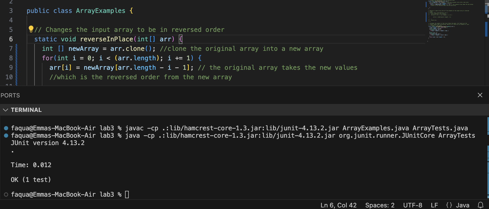
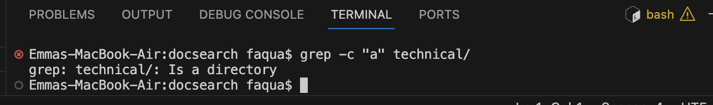

# LAB REPORT 3 - Bugs and Commands
## Emma Nguyen - PID 18021060
1. Part 1 - Bugs
   - Choose one of the bugs from week 4's lab
     
    ```
    ArrayExamples.java
    
    public class ArrayExamples {
    // Changes the input array to be in reversed order
    static void reverseInPlace(int[] arr) {
    for(int i = 0; i < arr.length; i += 1) {
      arr[i] = arr[arr.length - i - 1];
    }
   }
    // Returns a *new* array with all the elements of the input array in reversed order
   static int[] reversed(int[] arr) {
    int[] newArray = new int[arr.length];
    for(int i = 0; i < arr.length; i += 1) {
      arr[i] = newArray[arr.length - i - 1];
    }
    return arr;
    }
    ```
  
   - A failure-inducing input for the buggy program, as a JUnit test and any associated code.
     ```
     ArrayTests.java
     
     public class ArrayTests {
     @Test
     public void testReverseInPlace() {
     int[] input1 = { 3 };
     ArrayExamples.reverseInPlace(input1);
     assertArrayEquals(new int[]{ 3 }, input1);
     }
     @Test
     public void testReversed() {
      int[] input1 = { };
      assertArrayEquals(new int[]{ }, ArrayExamples.reversed(input1));
      }
     }
	
     ```
     - The failure-inducing inputs are `int[] input1 = { 3 };` in `testReverseInPlace()` and `int[] input1 = { };` in `testReversed()`. When the input with an array of 1 element or no element, the result cannot reflect whether the array is in reversed order or not. Therefore, the code passed the test even though there are bugs in the code.
   - An input that doesn't induce a failure, as a JUnit test and any associated code:
     - Wrong failure-inducting input:
     `int[] input1 = { 3 };` (in `testReverseInPlace()`) and
     `int[] input1 = { };` (in `testReversed()`)
	
     - The correct input:
     `int[] input1 = { 1, 2, 3, 4, 5};`
     
     - This input with an array of 5 elements can test if the result is an reversed array or not.
   - The symptom, as the output of running the tests.
     
     - The test is passed eventhougt the code has bug.
     
     - The code doesn't pass the test since the input was updated.
   - The bug, as the before and after code change required to fix it.
     - The code BEFORE fixing the bug.
       ```
       public class ArrayExamples {
       //Changes the input array to be in reversed order
       static void reverseInPlace(int[] arr) {
       for(int i = 0; i < (arr.length); i += 1) {
       arr[i] = arr[arr.length - i - 1]; // bug is here
       }
       }
       ```
       The bug here is when the for loop run, the new elements were added to the original array. After the array run more than a half of the length, the code used the new values of the array, which was reversed from the previous loops and do the reverse again, while it suppose to take the elements from the original array. Therefore, the output was incorrect and it did not pass the test
     - The code AFTER fixing the bug.
        ```
       public class ArrayExamples {
       //Changes the input array to be in reversed order
       static void reverseInPlace(int[] arr) {
       int [] newArray = arr.clone();
       for(int i = 0; i < (arr.length); i += 1) {
       arr[i] = newArray[arr.length - i - 1]; // bug is here
       }
       }
       ```
       
       To fix this bug, we copy the original array into the new array and run the reverse orders based on the new array, then write it back to the original array.
3. Part 2 - Researching Commands
   - I chose the `grep` command and use `man grep` command to display the information about `grep` command.
     - These `grep` commands was used information from [GBU Grap website](https://www.gnu.org/software/grep/manual/grep.html#Command_002dline-Options). I found this source as a `URL` by searching on google.com.
     -  ```grep [option] [patterns] [file]```.
       To use `grep` command, there can be zero or more `option` arguments, zero or more `file` arguments. There can be one or more `patterns` arguments seperated by new lines.
     - [1] Using the command `grep -c` on file
       
       - The command means count the letter `a` in the `grep-output1.txt` file. The output is 6 which is the number of letter `a` in the file. This command is useful in statistic report for how many times the letter/ number/ word is used in a file, a research or a study.
     - [2] Using the command `grep -c` on directory.
       
       - The `grep -c` command does not work on the directory.
     - [3] Using the command `grep -r` on file
       
       - The command means search for "biomed" in `grep-results.txt` file.
     - [4] Using the command `grep -r` on directory.
       
       - The command means search for "biomed" all files under technical/ directory. The `grep -c` works for both on file and directory.
       - This command is useful to find the information relevant to the key word.
     - [5] Using the command `grep -C number` on file: print num lines of leading and trailing output context. 
       
       - The output prints 3 lines after the line contains "io".
       - I think this command is useful to find the information relate to the key word, and also provide more information after that by choosing the numbers of next lines after the line contain the key word.
     - [6] Using the command `grep -C number` on directory.
       
       - The `grep -C number` command does not work on the directory.
     - [7] Using command `grep "2001" find-results.txt| grep "research0007" > newOutput.txt` on file.
       
       - The command finds line(s) which contains both "2001" and "research0007" in find-result.txt file and print it out to the new file named newOutput.txt. This command is useful in filter the exact content that the user looks for. 
     - [8] Using the command `grep "2001" docsearch/| grep "research0007" > newOutput.txt` on directory.
       
       - The command does not work on directory.
       - Home directory: `/Users/faqua` and `docsearch/` is the directory in the home directory.
